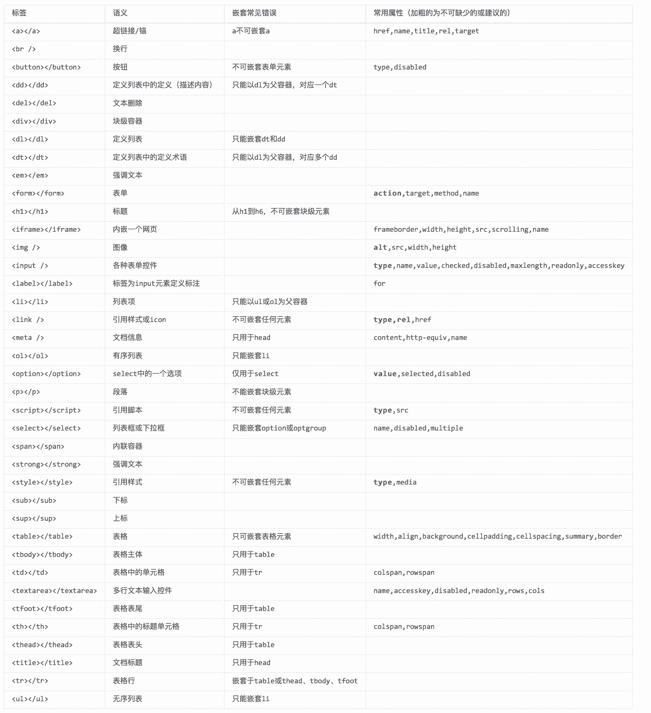

# 前端代码规范 及 最佳实践

编写本文档的主要驱动力是两方面： 
1. 代码一致性。 
2. 通过保持代码风格和传统的一致性，我们可以减少遗留系统维护的负担，并降低未来系统崩溃的风险。而通过遵照最佳实践，我们能确保优化的页面加载、性能以及可维护的代码。

## 工程文件

```
├── README.md //项目说明文件
├── dist //项目发布文件夹
├── package.json  //项目说明文档
└── src //项目源文件夹
    ├── css 
    ├── index.html
    ├── js
    │   ├── app
    │   │   ├── module1 //功能模块JS 1
    │   │   │   └── index.js
    │   │   ├── module2 //功能模块JS 2
    │   │   │   └── index.js
    │   │   └── module3 //功能模块JS 3
    │   │       └── index.js
    │   └── libs //第三方JS
    └── pages
        ├── module1 //功能模块页面 1
        │   └── index.html
        ├── module2 //功能模块页面 2
        │   └── index.html
        └── module3 //功能模块页面 3
            └── index.html
```
## HTML规范

### 整体结构
####HTML基础设施
- 文件应为标准的HTML5规范，首行以“<!DOCTYPE html>”
- 必须申请文档的编码charset，且与文件本身编码保持一致，使用UTF-8进行编码。
- 必须填写title标签，以表明本页面所实现的功能。
- 根据页面要求，设计页面所支持的viewport
- 页面中如使用HTML5新标签，需根据页面要求进行相应的兼容。

``` html
<!DOCTYPE html>
<html lang="zh-cn">
  <head>
    <meta charset="utf-8">
    <meta http-equiv="X-UA-Compatible" content="IE=edge">
    <meta name="viewport" content="width=device-width, initial-scale=1">
    <title>html</title>
    <!--[if lt IE 9]>
      <script src="js/html5shiv.min.js"></script>
    <![endif]-->
  </head>
  <body></body>
  <script src="jquery.js"></script>
</html>
```
#### 结构顺序和视觉顺序基本保持一致
- 按照从上至下、从左到右的视觉顺序书写HTML结构。
- 用div代替table布局，可以使HTML更具灵活性，也方便利用CSS控制。
- table不建议用于布局，但表现具有明显表格形式的数据，table还是首选。

#### 结构、表现、行为三者分离，避免内联
- 使用link将css文件引入，并置于head中。
- 使用script将js文件引入，并置于body底部。

#### 保持良好的简洁的树形结构
- 每一个块级元素都另起一行，每一行都使用Tab缩进对齐（head和body的子元素不需要缩进）。删除冗余的行尾的空格。
- 建议使用4个空格代替1个Tab（大多数编辑器中可设置）。
- 也可以在大的模块之间用空行或注释隔开，使模块更清晰。


```
<body>
<!-- 侧栏内容区 -->
<div class="m-side">
    <div class="side">
        <div class="sidein">
            <!-- 热门标签 -->
            <div class="sideblk">
                <div class="m-hd3"><h3 class="tit">热门标签</h3> </div>
                ...
            </div>
            <!-- 最热TOP5 -->
            <div class="sideblk">
                <div class="m-hd3"><h3 class="tit">最热TOP5</h3> <a href="#" class="s-fc02 f-fr">更多»</a></div>
                ...
            </div>
        </div>
    </div>
</div>
<!-- /侧栏内容区 -->
</body>
```
#### 注，应该注意以下几点
- 结构上如果可以并列书写，就不要嵌套
`如果可以写成<div></div><div></div>那么就不要写成<div><div></div></div>`

- 如果结构已经可以满足视觉和语义的要求，那么就不要有额外的冗余的结构。
`比如<div><h2></h2></div>已经能满足要求，那么就不要再写成<div><div><h2></h2></div></div>`
- 一个标签上引用的className不要过多，越少越好。
`比如不要出现这种情况：<div class="class1 class2 class3 class4"></div>`
- 对于一个语义化的内部标签，应尽量避免使用className,可以使用"m-help li"。
`比如在这样一个列表中，li标签中的itm应去除：<ul class="m-help"><li class="itm"></li><li class="itm"></li></ul>
`

###代码格式
#### 注释方法
采用类似标签闭合的写法，与HTML统一格式；注释文案两头空格，与CSS注释统一格式。
- 开始注释：<!-- 注释文案 -->（文案两头空格）。
- 结束注释：<!-- /注释文案 -->（文案前加“/”符号，类似标签的闭合）。
- 允许只有开始注释！

```
<!-- 头部 -->
<div class="page-hd">
    <!-- LOGO -->
    <h1 class="page-logo"><a href="#">LOGO</a></h1>
    <!-- /LOGO -->
    <!-- 导航 -->
    <ul class="page-nav">
        <li><a href="#">NAV1</a></li>
        <li><a href="#">NAV2</a></li>
        <!-- 更多导航项 -->
    </ul>
    <!-- /导航 -->
</div>
<!-- /头部 -->
```
#### 代码本身的注释
单行代码的注释也保持同行，两端空格；多行代码的注释起始和结尾都另起一行并左缩进对齐。

```
<!-- <h1 class="page-logo"><a href="#">LOGO</a></h1> -->
<!--
<ul class="page-nav">
    <li><a href="#">NAV1</a></li>
    <li><a href="#">NAV2</a></li>
</ul>
-->
```
#### 严格的嵌套
- 尽可能以最严格的xhtml strict标准来嵌套，比如内联元素不能包含块级元素等等。
- 正确闭合标签且必须闭合。

#### 严格的属性
- 属性和值全部小写，每个属性都必须有一个值，每个值必须加双引号。
- 没有值的属性必须使用自己的名称做为值（checked、disabled、readonly、selected等等）。
- 可以省略style标签和script标签的type属性。

#####常用的标签


###内容语义
#### 内容类型决定使用的语义标签
在网页中某种类型的内容必定需要某种特定的HTML标签来承载，也就是我们常常提到的根据你的内容语义化HTML结构。
#### 加强“资源型”内容的可访问性和可用性
在资源型的内容上加入描述文案，比如给img添加alt属性，在audio内加入文案和链接等等。
#### 加强“不可见”内容的可访问性
背景图上的文字应该同时写在html中，并使用css使其不可见或利用title属性，也可以在css失效的情况下看到内容。
#### 适当使用实体
以实体代替与HTML语法相同的字符，避免浏览解析错误。
常用HTML字符实体（建议使用实体）：

| 字符 | 名称 | 实体名 | 实体数 |
| --- | --- | --- | --- |
| " | 双引号 | &quot; | &#34; |
| & | &符 | &amp; | &#38; |
| < | 左尖括号（小于号） | &lt; | &#60; |
| > | 右尖括号（大于号） | &gt; | &#62; |
|  | 空格 | &nbsp; | &#160; |
|  | 中文全角空格 |  | &@12288; |

## CSS规范
### 分类方法
#### CSS文件的分类和引用顺序
在项目中我们需要把CSS文件进行分类。
可按照CSS的性质和用途，将CSS文件分成"公共样式"、"功能模块样式"，并按此顺序进行加载。

1. 公共型样式：包括了以下几个部分：“标签的重置和设置默认值”、“统一调用背景图和清除浮动或其他需统一处理的样式”。
2. 功能模块样式：包括了针对每个功能模块定义的特殊样式。

```
<link href="assets/css/global.css" rel="stylesheet" type="text/css"/>
<link href="assets/css/index.css" rel="stylesheet" type="text/css"/>
```

#### CSS内部分类及其顺序
1. 重置（reset）和默认（base）（tags）：消除默认样式和浏览器差异，并设置部分标签的初始样式，以减少后面的重复劳动。
2. 页面布局(layout) （.l_):将页面分割为几个大块，如头部，主体，主栏，侧栏，尾部等。
3. 模块(module) （.m_)：是一个语义化的可以重复使用的较大的整体！比如登录、注册、各种列表等。
> 注：公共型样式，使用reset.css文件。
> 其他功能性样式根据设计需求进行提练出相对应的公共样式，如字体大小，字体，字体颜色，按钮样式，背影图等。


### 命名规则

#### 命名规则
使用BEM命名规则（block:块，element:元素，modifier:修饰符)结合上述命名要求.通过给每个元素添加它的父级block模块作为前缀，使得目标的安全性变得更加简单了。BEM还有助于消除页面和body类对嵌套或者附加样式依赖。

``` CSS
.l_page_head {} /*布局页面头部*/
.m_sigin_btn_submit {} /*登录模块提交按钮*/
.l_page_main {} /*布局页面主体*/
.l_page_footer {} /*布局页面尾部*/
```

> 注：样式必须定义一个大类，并符合单个字母+"_"为前缀的规则。即”.l_“.
> 在后代选择器命名中**不允许出现语义化的的类选择器出现**。如：".l_page_head .a"

#### 分组选择器有时可以代替扩展方法
有时候虽然两个同类型的模块很相似，但他们之间不要有依赖关系，在不使用扩展方法的前提下，可以通过合并选择器来设置共性的样式。

使用本方法的前提是：相同类型、功能和外观都相似，写在同一片代码区域方便维护。


``` CSS
/* 两个元件共性的样式 */
.u_tip1,.u_tip2{}
.u_tip1 .itm,.u_tip2 .itm{}
/* 在分别是两个元件各自的样式 */
/* tip1 */
.u_tip1{}
.u_tip1 .itm{}
/* tip2 */
.u_tip2{}
.u_tip2 .itm{}
```
#### 防止污染和被污染
当模块或元件之间互相嵌套，且使用了相同的标签选择器或其他后代选择器，那么里面的选择器就会被外面相同的选择器所影响。

所以，在模块或元件可能嵌套或被嵌套于其他模块或元件，那么要慎用标签选择器，必要时采用类选择器，并注意命名方式，可以采用.m-layer .layerxxx、.m-list2 .list2xxx的形式来降低后代选择器的污染性。

### 代码格式

##### 选择器、属性和值都使用小写。

在xhtml标准中规定了所有标签、属性和值都应小写同步css也是如此。

##### 省略值为0时的单位

为节省不必要的字节同时也使阅读方便，我们将0px、0em、0%等值缩写为0。

```CSS
.m_box{margin:0 10px;background-position:50% 0;}
```

##### 浏览器私有在前，公有在后。

先写带有浏览器私有标志的，后写W3C标准的。

``` CSS
.m_box{-webkit-box-shadow:0 0 0 #000;-moz-box-shadow:0 0 0 #000;box-shadow:0 0 0 #000;}
```

##### 注释格式：/* 注释文字 */

1. 对选择器的注释统一写在被注释对象的上一行，对属性及值的注释写于分号后。

2. 注释内容两端需空格，已确保即使在编码错误的情况下也可以正确解析样式。

3. 在必要的情况下，可以使用块状注释，块状注释保持统一的缩进对齐。

4. 原则上每个系列的样式都需要有一个注释，言简意赅的表明名称、用途、注意事项等。


``` CSS
/* 块状注释文字
 * 块状注释文字
 * 块状注释文字
 */
.m_list{width:500px;}
.m_list li{height:20px;line-height:20px;/* 这里是对line-height的一个注释 */overflow:hidden;}
.m_list li a{color:#333;}
/* 单行注释文字 */
.m_list li em{color:#666;}
```

##### 功能性模块样式全写在一个样式文件内，模块前后必须要有注释开始和结束。

``` CSS
/***** 登录模块开始 *****/
.l_sigin_form {}
.l_singin_btn_submit{}
/***** 登录模块结束 *****/
```

##### 统一Hack方法
    使用Hack进行兼容IE浏览器，要统一使用“*”和“_”分别对IE7和6进行Hack。如下代码所示：
    
``` CSS
/* IE7会显示灰色#888，IE6会显示白色#fff，其他浏览器显示黑色#000 */
.m_list{color:#000;*color:#888;_color:#fff;}
```

##### 选择器顺序
    请综合考虑以下顺序依据：

1. 从大到小（以选择器的范围为准）
2. 从低到高（以等级上的高低为准）
3. 从先到后（以结构上的先后为准）
4. 从父到子（以结构上的嵌套为准）
    以下仅为简单示范：
    
``` CSS
/* 从大到小 */
.m_list p{margin:0;padding:0;}
.m_list p.part{margin:1px;padding:1px;}
/* 从低到高 */
.m_logo a{color:#f00;}
.m_logo a:hover{color:#fff;}
/* 从先到后 */
.l_hd{height:60px;}
.l_bd{height:60px;}
.l_ft{height:60px;}
/* 从父到子 */
.m_list{width:300px;}
.m_list .itm{float:left;}
```

##### 注意选择器等级

1. a = 行内样式style。

2. b = ID选择器的数量。

3. c = 类、伪类和属性选择器的数量。

4. d = 类型选择器和伪元素选择器的数量。

### 优化方案

##### 避免耗性能的属性

以下所举列的属性可能造成渲染性能问题。

``` CSS
/* expression */
.class{width:expression(this.width>100?'100px':'auto');}
/* filter */
.class{filter:alpha(opacity=50);}
```

##### 选择器合并

CSS选择器组合，可以一次定义多个选择器，节省很多字节和宝贵时间。

将定义相同的或者有大部分属性值相同（确实是因为相关而相同）的一系列选择器组合到一起（采用逗号的方法）来统一定义。


``` CSS
/* 以下对布局类选择器统一做了清除浮动的操作 */
.l_hd:after,.l_bd:after,.g-ft:after{display:block;visibility:hidden;clear:both;height:0;content:".";}
.l_hd,.l_bd,.l_ft{zoom:1;}
/* 通常background总是会占用很多字节，所以一般情况下，我们都会这样统一调用 */
.m_logo,.m_help,.m_list li,.u_tab li,.u_tab li a{background:url(../images/sprite.png) no-repeat 9999px 9999px;}
.m_logo{background-position:0 0;}
/* 以下是某个元件的写法，因为确实很多元素是联动的或相关的，所以采用了组合写法，可以方便理解和修改 */
.u_tab li,.u_tab li a{display:inline;float:left;height:30px;line-height:30px;}
.u_tab li{margin:0 3px;}
.u_tab li a{padding:0 6px;}
```

##### 背景图优化合并

图片本身的优化：
1. 图像质量要求和图像文件大小决定你用什么格式的图片，用较小的图片文件呈现较好的图像质量。
2. 当图片色彩过于丰富且无透明要求时，建议采用jpg格式并保存为较高质量。
3. 当图片色彩过于丰富又有透明或半透明要求或阴影效果时，建议采用png24格式，并对IE6进行png8退化（或在不得已情况下使用滤镜）。
4. 当图片色彩不太丰富时无论有无透明要求，请采用png8格式，大多数情况下建议采用这种格式。
5. 当图片有动画时，只能使用gif格式。
6. 你可以使用工具对图片进行再次压缩，但前提是不会影响色彩和透明。

多张图片的合并：

1. 单个图标之间必须保留空隙，空隙大小由容器大小及显示方式决定。这样做的好处是既考虑了“容错性”又提高了图片的可维护性。
2. 图标的排列方式，也由容器大小及显示方式决定。排列方式分为以下几种：横向排列（容器宽度有限）、纵向排列（容器高度有限）、斜线排列（容器宽高不限），靠左排列（容器背景居左）、靠右排列（容器背景居右）、水平居中排列（容器背景水平居中）、垂直居中排列（容器背景垂直居中）。
3. 合并后图片大小不宜超过50K，建议大小在20K-50K之间。
4. 为保证多次修改后的图片质量，请保留一份PSD原始图，修改和添加都在PSD中进行，最后导出png。

分类合并：

并不是把所有的图标都合并在一张图片里就是最好的，除了要控制图片大小之外还要注意以下方法。

1. 按照图片排列方式，把排列方式一样的图片进行合并，便于样式控制。
2. 按照模块或元件，把同属于一个模块或元件的图片进行合并，方便模块或元件的维护。
3. 按照图片大小，把大小一致或差不多的图片进行合并，可充分利用图片空间。
4. 按照图片色彩，把色彩一致或差不多的图片进行合并，保证合并后图片的色彩不过于丰富，可防止色彩失真。
5. 综合以上方法进行合并。

##### 如果CSS可以做到，就不要使用JS

让CSS做更多的事，减轻JS开发量。

1. 用CSS控制交互或视觉的变化，JS只需要更改className。
2. 利用CSS一次性更改多个节点样式，避免多次渲染，提高渲染效率。
3. 如果你的产品允许不兼容低版本浏览器，那么动画实现可以交给CSS。

##### 文件压缩 (利用GRUNT,GULP,WEBPACK等打包工具)

合理的书写CSS能很大程度上减少文件大小，完成后，在不损坏文件内容的情况下，想尽一切办法压缩你的CSS，你可以借助压缩工具把注释和多余的空格、换行去掉。

### 最佳实践
##### 最佳选择器写法（模块）

``` CSS
/***** 这是某个模块开始 *****/
.m_nav{}/* 模块容器 */
.m_nav li,.m_nav a{}/* 先共性  优化组合 */
.m_nav li{}/* 后个性  语义化标签选择器 */
.m_nav a{}/* 后个性中的共性 按结构顺序 */
.m_nav a.a1{}/* 后个性中的个性 */
.m_nav a.a2{}/* 后个性中的个性 */
.m_nav .z_crt a{}/* 交互状态变化 */
.m_nav .z_crt a.a1{}
.m_nav .z_crt a.a2{}
.m_nav .btn{}/* 典型后代选择器 */
.m_nav .btn_1{}/* 典型后代选择器扩展 */
.m_nav .btn_dis{}/* 典型后代选择器扩展（状态） */
.m_nav .btn.z_dis{}/* 作用同上，请二选一（如果可以不兼容IE6时使用） */
.m_nav .m_sch{}/* 控制内部其他模块位置 */
.m_nav .u_sel{}/* 控制内部其他元件位置 */
.m_nav_1{}/* 模块扩展 */
.m_nav_1 li{}
.m_nav_dis{}/* 模块扩展（状态） */
.m_nav.z_dis{}/* 作用同上，请二选一（如果可以不兼容IE6时使用） */
/***** 这是某个模块结束 *****/
```

## JS规范

### 文件命名规范

### 命名规范

### 最佳实践

